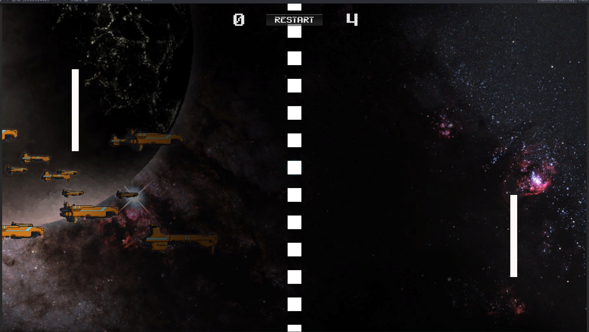

# Pong
> This is my first game built using the Unity game engine.

## Table of contents
* [General info](#general-info)
* [Screenshots](#screenshots)
* [Technologies](#technologies)
* [Setup](#setup)
* [Features](#features)
* [Status](#status)
* [Inspiration](#inspiration)
* [Contact](#contact)

## General info
I am a software developer for a law firm and love the job, but sometimes you need a change. I have decided to try my hand at game development for a hobby.

Having no experience, I have started at the beginning with the simplest game to build, Pong. I got the assets and code ideas from the following two sites: 

[Make A Pong Game With Unity 2D](https://www.awesomeinc.org/tutorials/unity-pong/ "Make A Pong Game With Unity 2D") and [Unity 2D Pong Game](https://noobtuts.com/unity/2d-pong-game "Unity 2D Pong Game")

## Screenshots


## Technologies
* Unity - version 2021.1.0f1
* Visual Studio Code - version 1.54.3

## Setup
Clone repository and build.

## Code Examples
Show examples of usage:
```csharp
using System.Collections;
using System.Collections.Generic;
using UnityEngine;
public class PlayerControls : MonoBehaviour
{
    private static readonly float InitialSpeed = 10.0f;
    private static readonly float BoundY = 2.25f;
    private static readonly string PaddleOneTagName = "PLAYER";
    private static readonly string PaddleTwoTagName = "OPPONENT";

    private string axis = null;
    private Rigidbody2D paddle = null;

    void Start()
    {
        paddle = GetComponent<Rigidbody2D>();
        string paddleTag = paddle.tag;
        if(paddleTag.ToUpper() == PaddleOneTagName)
        {
            axis = "Vertical";
        }
        else if(paddleTag.ToUpper() == PaddleTwoTagName)
        {
            axis = "Vertical2";
        }
    }

    // FixedUpdate is called once per fixed time interval, Use with any component
    // that has physics
    void FixedUpdate()
    {
        float paddleVelocity = Input.GetAxisRaw(axis);
        paddle.velocity = new Vector2(0.0f, paddleVelocity) * InitialSpeed;

        Vector3 currentPosition = transform.position;
        if(currentPosition.y > BoundY)
        {
            currentPosition.y = BoundY;
        }
        else if (currentPosition.y < -BoundY) 
        {
            currentPosition.y = -BoundY;
        }
        
        transform.position = currentPosition;
    }
}
```

## Features
List of features ready and TODOs for future development
* Two paddles that can be moved independently
* Stops game when one of the players reaches a score of ten

To-do list:
* Add sound when ball hits paddle or wall
* Create AI for the opponent paddle 
* Add a start screen with menu system.

## Status
Project is: _in progress_
Finding time is harder than you think when you have a full time job.

## Inspiration
Project inspired by...
* [Stack Exchange: Game Development](https://gamedev.stackexchange.com/ "Stack Exchange: Game Development")
* [What are good games to "earn your wings" with?](https://gamedev.stackexchange.com/questions/854/what-are-good-games-to-earn-your-wings-with "What are good games to earn your wings with?")
* [Zaratustra's answer to the question](https://gamedev.stackexchange.com/a/945/9930 "Zaratustra's answer to the question")

based on...
* [Make A Pong Game With Unity 2D](https://www.awesomeinc.org/tutorials/unity-pong/ "Make A Pong Game With Unity 2D")
* [Unity 2D Pong Game](https://noobtuts.com/unity/2d-pong-game "Unity 2D Pong Game")

## Contact
Created by [@LordFuture](https://github.com/LordFuture)